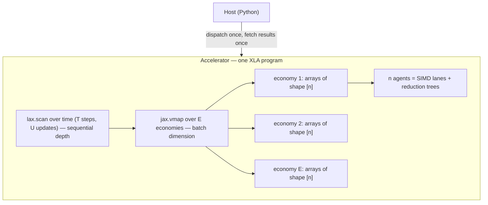

# Parallelism & Computational Complexity Report — JaxMARL-BC

A first-principles account of what one training run of **JaxMARL-BC** computes,
how that computation is laid out on a GPU, what limits it, and where it can be
improved. Nothing is assumed: every symbol is defined at first use, every
design choice is traced to a line of code, and one real run — the reference run
below — is carried through the whole document as a worked example.

> **Reference run** (`configs/exp/ks_remote.yaml`, `env.n_agents=1000`, Colab T4):
> Krusell–Smith economy, $n = 1000$ agents, $E = 16$ parallel environments,
> rollout length $T = 64$, $U = 2000$ updates, $K = 4$ epochs × $M = 4$
> minibatches, observation dim $d_o = 6$, action dim $d_a = 1$,
> policy network 64×64 tanh MLP with $P = 4739$ parameters.
> Totals: $U \cdot T = 128{,}000$ sequential steps,
> $U \cdot T \cdot E \cdot n \approx 2.0 \times 10^9$ agent-transitions.

**Contents**

- **Part I — The computation, from scratch**
  - [1. The problem and the notation](#1-the-problem-and-the-notation)
  - [2. The environment step](#2-the-environment-step)
  - [3. The learning algorithm](#3-the-learning-algorithm)
- **Part II — The implementation**
  - [4. The JAX/XLA execution model](#4-the-jaxxla-execution-model)
  - [5. The parallelism axes and their hardware mapping](#5-the-parallelism-axes)
  - [6. Design decisions in this codebase](#6-design-decisions-in-this-codebase)
- **Part III — The analysis**
  - [7. Memory model](#7-memory-model)
  - [8. What bounds throughput](#8-what-bounds-throughput)
  - [9. Principal components of the compute blob](#9-principal-components-of-the-compute-blob)
- **Part IV — The frontier**
  - [10. Improvement attack vectors](#10-improvement-attack-vectors)
  - [11. Architectural comparison](#11-architectural-comparison-standard-marl-vs-jaxmarl-bc)

---

# Part I — The computation, from scratch

## 1. The problem and the notation

The codebase solves heterogeneous-agent macroeconomic models — Real Business
Cycle (RBC) with endogenous labour, and Krusell–Smith (KS) — as Multi-Agent
Reinforcement Learning. Every household is an agent. All households share
**one** policy network ("social learning"): a single set of parameters
$\theta$ maps any agent's observation to that agent's action. Agents interact
**only through market-clearing prices**, which depend on population aggregates
— never on any individual pairwise. This *mean-field* coupling is the
single most important structural fact in the whole report: agents never
communicate, so a population step needs only two $\mathcal{O}(n)$ reductions,
and everything else about an agent is embarrassingly parallel.

The entire training run is one pure function:

$$\text{train} : \text{rng seed} \;\longmapsto\; (\theta^*, \text{metrics}, \text{parameter history})$$

compiled ahead of time into a single GPU program (Part II explains how).

### 1.1 Notation

Fixed for the whole document. "Ref." is the reference run's value.

| Symbol | Ref. | Name | Precise meaning | Config key |
| :-- | --: | :-- | :-- | :-- |
| $n$ | 1000 | population | households (agents) inside **one** simulated economy | `env.n_agents` |
| $E$ | 16 | environments | independent copies of the economy simulated in parallel, each with its own shock history | `train.num_envs` |
| $T$ | 64 | rollout length | consecutive time steps simulated **between two policy updates** (see §3.2 — this is a *learning cadence*, not an economic horizon) | `train.rollout_len` |
| $H$ | 500 | episode length | steps after which an economy is reset to initial conditions (an *environment* notion, unrelated to $T$; see §3.2) | `env.max_steps` |
| $U$ | 2000 | updates | number of PPO parameter updates over the run; **derived**: $U = \texttt{total\_timesteps} / T$ | — |
| $K$ | 4 | epochs | full passes over the freshly collected data within one update | `train.update_epochs` |
| $M$ | 4 | minibatches | slices each epoch's data is split into; one gradient step per slice | `train.num_minibatches` |
| $B$ | 1.02 M | batch | transitions collected per update: $B = T \cdot E \cdot n$ | — |
| $b$ | 256 k | minibatch | $b = B / M$ samples per gradient step | — |
| $d_o$ | 6 | obs dim | numbers one agent observes per step (here: own capital, own labour, mean capital, aggregate state, $\kappa$, $\lambda$) | `env.obs_vars` |
| $d_a$ | 1 | action dim | numbers one agent outputs per step (KS: consumption fraction) | env-specific |
| $P$ | 4739 | parameters | scalar weights in the shared network $\theta$ | `net.hidden_dims` |
| $\gamma$ | 0.99 | discount | RL discount factor, set equal to the households' $\beta$ | `train.gamma` |
| $\lambda_{\text{GAE}}$ | 0.95 | GAE parameter | bias–variance knob for advantage estimation (§3.4) | `train.gae_lambda` |
| $\tau$ | 7 (KS) | shock correlation time | integrated autocorrelation time of the aggregate shock (§9.3) | calibration |

Two derived quantities used constantly:

- **sequential steps** $= U \cdot T$ — how many times the simulated clock
  ticks, one tick advancing all $E$ economies at once. This is what
  `total_timesteps` counts (`jmbc/algos/make_train.py:48`); it is deliberately
  *independent of $E$ and $n$*, so widening the run adds data, not duration.
- **agent-transitions** $= U \cdot T \cdot E \cdot n$ — total (state, action,
  reward) samples seen by the learner. Reference run: $2.0 \times 10^9$.

### 1.2 The three nested clocks

A recurring source of confusion, worth fixing immediately. There are **three
time scales**, and they do not align:

```text
 total run      |———————————————— U·T = 128,000 sequential steps ————————————————|
 episodes  (H)  |——— 500 ———|——— 500 ———|——— 500 ———| ...   (economy resets, env semantics)
 rollouts  (T)  |—64—|—64—|—64—|—64—|—64—|—64—|—64—| ...   (policy updates, learning cadence)
```

- The **episode** ($H = 500$) belongs to the *environment*: after $H$ steps the
  economy auto-resets to initial conditions. It exists to bound trajectories
  and re-randomize; the households' problem itself is infinite-horizon.
- The **rollout** ($T = 64$) belongs to the *learner*: every $T$ steps,
  training pauses simulation and updates $\theta$. Episode boundaries fall
  *inside* rollouts and are handled by the `done` flag (§3.4).
- Neither is the horizon the *agent* optimizes: that is set by the discount,
  effective horizon $\approx 1/(1-\gamma) = 100$ steps (§3.4).

## 2. The environment step

One tick of one economy (`_step_core`, `jmbc/envs/env_ksmf.py:180` for KS,
`jmbc/envs/env_std.py:105` for RBC) is a short chain of vector operations over
the population. Superscript $i$ indexes agents, subscript $t$ time; $\kappa^i,
\lambda^i$ are fixed per-agent capital/labour productivities (all 1.0 when
homogeneous).

1. **Aggregation** — two weighted population means:

$$K_t = \frac{1}{n}\sum_{i=1}^{n} \kappa^i k_t^i, \qquad L_t = \frac{1}{n}\sum_{i=1}^{n} \lambda^i \ell_t^i$$

   *Cost:* two $\mathcal{O}(n)$ reductions. This is the **only** inter-agent
   communication in the entire model.

2. **Production and pricing** — Cobb–Douglas output; factor prices equal
   marginal products (competitive markets):

$$Y_t = A_t K_t^{\alpha} L_t^{1-\alpha}, \qquad r_t = \alpha \frac{Y_t}{K_t}, \qquad w_t = (1-\alpha)\frac{Y_t}{L_t}$$

   *Cost:* $\mathcal{O}(1)$ — prices are functions of aggregates only.

3. **Individual budget** — each household's wealth is labour income + capital
   income + undepreciated capital; the policy's action, a consumption fraction
   $\hat c_t^i \in (0,1)$, splits it:

$$a_t^i = w_t \lambda^i \ell_t^i + r_t \kappa^i k_t^i + (1-\delta)k_t^i, \qquad c_t^i = \hat c_t^i\, a_t^i, \qquad k_{t+1}^i = (1-\hat c_t^i)\, a_t^i$$

   The per-agent reward is period utility, $\log c_t^i$.
   *Cost:* $\mathcal{O}(n)$ elementwise.

4. **Exogenous shocks** — RBC: one AR(1) draw for total factor productivity
   $A_t$, $\mathcal{O}(1)$. KS: one **common** aggregate-state draw
   (good/bad), then $n$ per-agent employment draws conditional on the
   aggregate transition, $\mathcal{O}(n)$. (The factored chain in
   `build_ks_conditional` exists because drawing the joint chain independently
   per agent kills aggregate risk for $n \gtrsim 20$ — a semantics constraint,
   not a performance one.)

5. **Policy inference** — every agent queries the shared network (defined in
   §3.1): one batched forward pass over $n$ observation rows,
   $\mathcal{O}(n \cdot P)$.

A full step is therefore $\mathcal{O}(n \cdot P)$ work with **no sequential
dependency between agents** — the ideal shape for SIMD hardware. The
sequential dependency is only in $t$: step $t{+}1$ needs $k_{t+1}$, which
needs step $t$'s actions. Time is a true recurrence and cannot be
parallelized (§5, §9).

## 3. The learning algorithm

The trainer is PPO — *Proximal Policy Optimization* — an **on-policy**
policy-gradient method. This section builds it up from scratch in the order
data flows: network → rollout → buffer → advantages → update.

### 3.1 The shared actor-critic network

One MLP (`jmbc/algos/nn.py`) with two heads serves all $n \cdot E$ agents:

- **input**: one agent's observation $o \in \mathbb{R}^{d_o}$;
- **trunk**: Dense(64) → tanh → Dense(64) → tanh;
- **actor head**: Dense($d_a$) giving the mean of a Gaussian over actions,
  plus a learned state-independent log-std — the *policy*
  $\pi_\theta(\cdot \mid o)$;
- **critic head**: Dense(1) giving the *value* $V_\theta(o)$ — the network's
  estimate of the discounted return $\mathbb{E}\left[\sum_{s\ge0} \gamma^s r_{t+s}\right]$
  from this observation, used only during training (§3.4).

Parameter count (reference run): $6{\cdot}64{+}64$ + $64{\cdot}64{+}64$ +
$(64{\cdot}1{+}1)$ + $1$ + $(64{\cdot}1{+}1)$ = **4739**. One forward pass
costs $\approx 2P \approx 9.5\text{k}$ FLOPs per agent. Because $\theta$ is
shared, evaluating all agents in all environments is a single
$[E \cdot n, d_o]$ matrix–matrix product — 16,000 rows in the reference run
(the launch banner's "actors 16,000").

### 3.2 The rollout: what "rollout length" is

A **rollout** is the data-collection phase: starting from the current
simulator state, advance all $E$ environments $T$ consecutive steps using the
**current** policy $\pi_\theta$, recording everything. $T$ (= `rollout_len`,
64 here) answers one question: *how much fresh experience is gathered between
two parameter updates?* It is a pure learning-cadence knob:

- **Larger $T$** → each update sees more data ($B = T E n$ grows) and GAE gets
  longer horizons to work with (§3.4), but updates become rarer
  ($U = \texttt{total\_timesteps}/T$ falls) and the data used at the end of an
  update was generated by an increasingly stale policy.
- **Smaller $T$** → frequent, fresher updates, but fewer samples each, and
  more of the (sequential, §8) update overhead per unit of simulation.

Each recorded step is a **transition** (the `Transition` NamedTuple,
`make_train.py:23`) holding, per agent: observation $o_t$, action $a_t$,
reward $r_t$, the critic's value $V_\theta(o_t)$, the log-probability
$\log \pi_\theta(a_t \mid o_t)$, and the episode-termination flag $d_t$. The
rollout produces arrays of shape $[T, E, n, \cdot]$.

### 3.3 The trajectory buffer — and why there is *no replay buffer*

The rollout's output *is* the buffer: a $[T, E, n]$ block of transitions,
materialized as the stacked output of the rollout scan. Its lifecycle is the
defining feature of on-policy learning:

```text
collect (T steps) ──▶ compute advantages ──▶ reuse K times (epochs) ──▶ DISCARD
                                                                          │
      next rollout overwrites the same storage ◀──────────────────────────┘
```

This is **not a replay buffer**, and the distinction matters:

| | Replay buffer (off-policy: DQN, SAC) | Trajectory buffer (on-policy: PPO, here) |
| :-- | :-- | :-- |
| Contents | up to ~$10^6$ transitions from *many past policies* | exactly $B$ transitions from the *current* policy |
| Sampling | random with replacement, forever | each sample used exactly $K$ times, then destroyed |
| Lifetime | persists across the whole run | one update ($\approx T$ sim steps) |
| Why | value bootstrapping is valid off-policy | the policy-gradient estimator is only valid near the policy that generated the data |

PPO tolerates exactly $K$ reuses because its loss (§3.5) measures how far the
updating policy has drifted from the data-generating one (the ratio
$\rho$) and clips the objective when drift exceeds $\pm\varepsilon$. $K$ is
therefore a *sample-efficiency* knob bounded by trust, not by memory: the
in-loop `approx_kl` and `clip_frac` metrics are precisely the drift monitors.

Memory-wise, this buffer — not the network, not the optimizer — is the
dominant allocation, analyzed in §7.

### 3.4 Advantage estimation (GAE)

The policy gradient needs to know, for each recorded action, *was it better or
worse than expected?* — the **advantage** $A_t$. Raw discounted returns answer
this with enormous variance; the critic alone answers with bias. GAE
(*Generalized Advantage Estimation*) interpolates. Define the one-step
temporal-difference error — the immediate surprise relative to the critic:

$$\delta_t = r_t + \gamma (1 - d_t) V(o_{t+1}) - V(o_t)$$

($d_t$ zeroes the bootstrap across episode boundaries — this is how episodes
and rollouts coexist, §1.2). GAE is the geometrically-damped sum of future
surprises,

$$A_t = \sum_{s \ge 0} (\gamma \lambda_{\text{GAE}})^s\, \delta_{t+s}
\quad\Longleftrightarrow\quad
A_t = \delta_t + \gamma\lambda_{\text{GAE}} (1-d_t)\, A_{t+1},$$

computed by a **backward scan** over the rollout (`make_train.py:160`), with
the critic bootstrapping the tail beyond step $T$. Two horizons fall out, and
they anchor several later arguments:

- **value horizon** $1/(1-\gamma) = 100$ steps — how far the critic must
  integrate rewards; carried across rollout boundaries by bootstrapping, which
  is why $T = 64 < 100$ is legitimate;
- **credit horizon** $1/(1-\gamma\lambda_{\text{GAE}}) \approx 17$ steps — how
  far an action is directly credited for future surprises before the damping
  kills it. $T = 64 \approx 4\times$ this: comfortable.

The regression target for the critic is $A_t + V(o_t)$ ("targets" in the
code).

### 3.5 The update: epochs, minibatches, and the PPO loss

With advantages in hand, the update phase performs $K \cdot M$ gradient steps
on the buffer:

1. **Flatten** $[T, E, n] \to [B]$: every agent-step becomes one independent
   training sample. (This is where the shared-policy/mean-field structure pays
   off — samples from different agents are exchangeable by construction.)
2. **Shuffle** with a fresh random permutation each epoch: consecutive samples
   are strongly correlated in $t$ and within an environment (§9.3); SGD wants
   minibatches that look i.i.d., and the permutation is what delivers that.
3. **Slice** into $M$ minibatches of $b = B/M$ and take one Adam step per
   slice, minimizing the clipped PPO objective. Per sample, with
   $\rho = \frac{\pi_\theta(a\mid o)}{\pi_{\theta_{\text{old}}}(a \mid o)}$
   (new policy / data-generating policy):

$$\mathcal{L} = \underbrace{-\min\!\big(\rho A,\; \text{clip}(\rho, 1{-}\varepsilon, 1{+}\varepsilon) A\big)}_{\text{policy: improve, but not past } \pm\varepsilon \text{ drift}}
\;+\; c_v \underbrace{(V_\theta - \text{target})^2}_{\text{critic regression}}
\;-\; c_e \underbrace{\mathcal{H}[\pi_\theta]}_{\text{exploration bonus}}$$

4. **Repeat** the shuffle+sweep $K$ times (epochs), then discard the buffer.

Advantages are normalized per minibatch; gradients are global-norm-clipped;
the learning rate optionally anneals linearly (a traced scalar — free, §9.6).

### 3.6 The assembled loop

Everything above, in the exact nesting of `make_train.py` (each `for` is a
`lax.scan`, §4.3):

```text
θ ← init;  obs, state ← vmap(env.reset)                  # [E, n, d_o]
for u in 1..U:                                           # 2000  (sequential)
  # ── rollout: T steps with the CURRENT π_θ ──
  for t in 1..T:                                         # 64    (sequential)
    π, V ← network(θ, obs)              # one GEMM over E·n = 16,000 rows
    a ~ π;  logp ← log π(a)
    obs, state, r, d ← vmap(env.step)(state, a)          # E economies at once
    buffer[t] ← (obs, a, r, V, logp, d)
  A, targets ← GAE(buffer, V_last)                       # backward scan over T
  # ── update: K·M gradient steps on the SAME buffer ──
  for k in 1..K:                                         # 4     (sequential)
    perm ← random permutation of B = 1,024,000
    for j in 1..M:                                       # 4     (sequential)
      θ ← Adam(θ, ∇ PPO-loss(buffer[perm slice j]))      # b = 256,000 samples
  # buffer discarded; next rollout overwrites it
```

### 3.7 Complexity accounting

| Phase | Work (FLOPs-scale) | Sequential depth | Ref. run work |
| :-- | :-- | :-- | :-- |
| Rollout inference | $U \cdot T \cdot E \cdot n \cdot 2P$ | $U \cdot T$ | $1.9 \times 10^{13}$ |
| Env dynamics | $U \cdot T \cdot E \cdot n \cdot \mathcal{O}(1)$ | $U \cdot T$ | negligible |
| GAE | $U \cdot T \cdot E \cdot n$ | $U \cdot T$ (as written; §10-F: $U \log T$) | negligible |
| Updates (fwd+bwd) | $U \cdot K \cdot B \cdot 6P$ | $U \cdot K \cdot M$ | $2.3 \times 10^{14}$ |
| **Total** | | $U(T + KM) = 160{,}000$ phases | $\approx 2.5 \times 10^{14}$ |

Reading: the whole reference run is **~250 TFLOPs — about 30 seconds of a
T4's peak fp32 throughput**. Actual wall time is far longer, because the
binding constraint is not arithmetic but the 160,000-deep chain of small
sequential phases (§8). That single observation — *this workload is
latency-bound, not compute-bound* — drives most of Parts II–IV.

---

# Part II — The implementation

## 4. The JAX/XLA execution model

Four JAX concepts explain both the speed and the constraints of this codebase.

### 4.1 Trace → lower → compile → execute

`jax.jit` does not interpret Python on the GPU. On first call it **traces**
the function: runs the Python once with abstract shapes (no data), recording
every array operation into a graph. The graph is **lowered** to XLA HLO,
**compiled** into fused device kernels, then **executed**; later calls with
the same shapes skip straight to execution. Three consequences:

- **Python cost is paid once, at trace time.** Python loops over data
  structures (like per-agent dicts) are *unrolled into the graph* — they
  become graph size and compile time. Root cause of §6.1.
- **Compile time is a real, separately-measured phase.** The trainer exposes
  an ahead-of-time hook (`train.lower`, `make_train.py:327`) so
  `run_and_time` (`jmbc/recorder.py:158`) reports trace / compile / run
  separately; `benchmark_time` runs twice and differences. Benchmarks never
  conflate one-time compilation with steady-state throughput.
- **Everything is shape-static.** $T, E, n, M$ are burned into the program;
  changing any of them recompiles (§9.6).

The result is **one XLA program for the entire training run** — all $U$
updates execute on-device with zero host↔device transfers and zero Python
between launch and completion. (Not literally one fused kernel — XLA emits
many kernels — but one program, dispatched once.)

### 4.2 `jax.vmap`: batching as a compiler transform

`vmap(f)` rewrites the traced graph of `f` so every operation gains a leading
batch dimension. Batching the $E$ environments therefore costs **zero
orchestration** — no threads, processes, or IPC: `vmap(env.step)` turns
per-economy `[n]` operations into `[E, n]` operations, which XLA maps onto the
GPU's parallel lanes. Until the device saturates (§8), adding an environment
is wall-clock-free.

### 4.3 `jax.lax.scan`: sequential loops on the device

A Python `for t in range(T)` inside `jit` would unroll into $T$ copies of the
step graph. `lax.scan` compiles the body **once** and emits an XLA `while`
loop: graph size $\mathcal{O}(1)$ in $T$, execution fully on-device, and the
stacked per-step outputs (the trajectory buffer, §3.3) allocated as one
contiguous $[T, \ldots]$ array. The training loop is three nested scans —
updates ⊃ rollout steps, and updates ⊃ epochs ⊃ minibatches — exactly the
`for` nesting of §3.6.

### 4.4 Functional arrays and memory

JAX arrays are immutable: every operation notionally allocates its output.
XLA aliases and reuses buffers where provably safe, but data-dependent
operations — the shuffle's permutation **gather** — must materialize real
copies. Peak memory is governed by *liveness* (how many full-batch tensors
coexist), not by the sum of allocations. This is the subject of §7.

## 5. The parallelism axes

| Axis | Size | Mechanism | Hardware realization |
| :-- | :-- | :-- | :-- |
| **1 — agents** | $n$ | state fields are `[n]` arrays (`state.ks`, …) | SIMD lanes; `jnp.mean` becomes a parallel reduction tree |
| **2 — environments** | $E$ | `jax.vmap(env.reset/step)` over split RNG keys | extra leading tensor dimension; fills streaming multiprocessors as $E \cdot n$ grows |
| **3 — time** | $T$, $U$, $K{\cdot}M$ | `jax.lax.scan` | on-device sequential loop — **not** parallel; this is the irreducible depth |



At any instant the parallel width presented to the GPU is $E \times n$
(rollout: 16,000 in the reference run) or $b$ (update: 256,000). The
sequential axes determine minimum wall time once the device is saturated.

## 6. Design decisions in this codebase

### 6.1 Vector interface vs. JaxMARL dict interface

> [!IMPORTANT]
> Standard JaxMARL environments exchange observations/actions as Python dicts
> `{ "agent_0": arr, ... }`. Under tracing (§4.1), building and consuming an
> $n$-entry dict unrolls into $\mathcal{O}(n)$ graph nodes per traced step.
> For thousands of agents this explodes trace memory and compile time — the
> classic failure mode when scaling JaxMARL populations.

The fix is the **vector interface**: `reset_mat` / `step_mat`
(`jmbc/envs/env_ksmf.py:134`, `jmbc/envs/env_std.py:57`) move one `[n, d_o]`
observation matrix and one `[n, d_a]` action matrix instead of dicts.
`make_train` auto-detects it (`use_vec`, `make_train.py:59`) and skips the
dict round-trip entirely:

- graph size becomes **independent of $n$** — $\mathcal{O}(1)$ compile-time
  complexity in the population; measured compiles stay ~0.9–1.8 s even at
  $n = 10{,}000$;
- dynamics and the RNG stream are **bit-identical** to the dict path (both
  wrap the same `_step_core`), so the JaxMARL interface remains available for
  compatibility and cross-checking;
- `VecLogWrapper` (`jmbc/envs/vec.py`) replicates JaxMARL's episode-return
  accounting on one `[n]` array, for the same reason;
- auto-reset is a branch-free `lax.select` between the stepped and freshly
  reset state (both computed each step — see §10-H).

### 6.2 Measurement methodology

Because compilation is a distinct phase (§4.1), the harness never reports one
opaque wall time: `run_and_time` uses the AOT path to time trace / compile /
run separately and derives throughput from run time only; `benchmark_time`
(used by the sweep) isolates compile cost by running twice; the sweep runner
(`jmbc/sweep.py`) writes both, plus end-of-run economic diagnostics, per cell.

### 6.3 Launch-time memory forecast

`_print_launch_summary` (`jmbc/experiments/common.py:41`) predicts device
memory from the config (§7 formula), compares against the device
`bytes_limit`, and warns above 80% — turning the most common failure (OOM in
the shuffle) into a pre-run warning with the correct remediations.

### 6.4 Chunked diagnostics rollouts

Evaluation simulates long deterministic (mean-action) trajectories
(5000 steps in the reference run) recording ~12 float channels per agent per
step. `simulate` (`jmbc/diagnostics/rollout.py:136`) runs the scan in
**segments** sized to keep the on-device record under `max_chunk_bytes`
(256 MB default), materializing each segment to host RAM before launching the
next: device memory is flat in evaluation length, so long-horizon evals cannot
OOM at any population. A per-`(env, net)` jitted runner with `params` as a
traced argument means one compile serves every training snapshot and segment.

---

# Part III — The analysis

## 7. Memory model

Memory, not compute, limits $T \cdot E \cdot n$ on a 16 GB-class GPU (Colab T4
being the reference runtime). The dominant object is the trajectory buffer of
§3.3 and its update-phase copies.

### 7.1 The buffer formula

Each flattened sample carries $d_o$ (obs) $+\, d_a$ (action) $+\, 7$ scalars
(done, value, reward, log-prob, episode-return info, advantage, target), fp32:

$$\text{bytes per copy} = B \cdot (d_o + d_a + 7) \cdot 4$$

During the update (`make_train.py:241`), peak liveness holds up to ~4
full-batch tensors — the stacked trajectory (alive across all $K$ epochs), the
flattened view, the **shuffled copy from the permutation gather** (`jnp.take`;
the single allocation that OOMs first), and gather workspace:

$$\text{Memory}_{\text{buffer}} \approx 4 \cdot T \cdot E \cdot n \cdot (d_o + d_a + 7) \cdot 4 \text{ bytes}$$

**Reference run**: $B = 1.02\text{M}$, 14 scalars/sample ⇒ 57 MB per copy,
~230 MB forecast — comfortable, which is exactly why that config could trade
minibatch count down to $M = 4$ (§9) without OOM risk.

### 7.2 Scaling table (KS: $d_o=6$, $d_a=1$ ⇒ 56 B/sample/copy)

| $E$ | $T$ | $n$ | $B$ | per copy | ×4 forecast | of T4 (15 GB usable) |
| --: | --: | --: | --: | --: | --: | --: |
| 16 | 64 | 1 000 | 1.0 M | 57 MB | 230 MB | 1.5% |
| 16 | 64 | 10 000 | 10.2 M | 574 MB | 2.3 GB | 15% |
| 64 | 200 | 2 000 | 25.6 M | 1.4 GB | 5.7 GB | 38% |
| 64 | 200 | 10 000 | 128 M | 7.2 GB | 28.7 GB | **OOM** |

Two smaller contributors: the **update working set** (one minibatch's
activations, $\approx b \cdot (\sum \text{hidden}) \cdot 16$ bytes —
controlled by $M$), and **`params_history`** — the scan stacks the full
parameter pytree every update, $U \cdot P$ floats (38 MB in the reference run;
grows linearly in both $U$ and network size — §10-B).

**Remediations, in order:** raise $M$ (shrinks working set), lower $E$ or $T$
(shrinks $B$), then the structural fixes §10-A/B/C.

## 8. What bounds throughput

Three regimes, in order of increasing width $E \cdot n$:

1. **Latency-bound (small width).** Each of the $U(T + KM)$ sequential phases
   (§3.7) launches kernels over arrays too small to fill the device; wall time
   ≈ depth × per-phase latency and is **nearly flat in $E \cdot n$**. The
   reference run sits here: 250 TFLOPs of arithmetic (~30 s at T4 peak)
   stretched over 160,000 sequential phases. In this regime, width is free
   statistical power — the central fact exploited in §9.
2. **Bandwidth-bound (large batch, small network).** A 64×64 MLP has low
   arithmetic intensity; rollout steps and especially the shuffle gather
   (pure data movement, $\mathcal{O}(B)$ bytes per epoch) hit the HBM
   bandwidth ceiling.
3. **Compute-bound (large network).** GEMMs dominate. The current MLP is far
   from this regime.

The knee between 1 and 2 maximizes throughput-per-sample; the sweep's
`throughput_steps_per_s` column locates it empirically per device. The
`ks_remote` config is itself an artifact of this analysis: it reshaped the
workload for a latency-bound device by cutting sequential optimizer steps
$K{\cdot}M$ from 200 to 16 and rollout depth from 200 to 64, while feeding the
width back up with $n$ — same transitions per update, one-third the depth.

## 9. Principal components of the compute blob

The run is a 7-dimensional box of compute — $(U, T, E, n, K, M, P)$ — and
naively every axis trades against every other. But the quantities anyone
actually cares about are three *low-dimensional functionals* of the box. These
are the principal components of the story; every config knob loads mostly on
one of them, and almost every design decision in this repo is an attempt to
spend one component to save another.

### 9.1 The three components

$$\textbf{PC1 — depth (wall time):}\quad D = U \cdot (T + K \cdot M)$$

The count of irreducibly sequential phases (§3.7) — the only thing you *wait*
for in the latency-bound regime. Note what is absent: $E$, $n$, $P$.

$$\textbf{PC2 — width (memory + gradient noise):}\quad W = T \cdot E \cdot n$$

The batch. It sets peak memory (§7, linearly) and gradient noise (inverse
square root). Note what is absent: $U$, $K$ — width says nothing about how
*long* you train, only how *well-measured* each step is.

$$\textbf{PC3 — information (what the learner can know):}\quad
I_{\text{agg}} = E \cdot \tfrac{T}{\tau}, \qquad I_{\text{idio}} = E \cdot T \cdot n$$

Effective *independent* sample counts per update — the same $W$ counted after
removing correlations (§9.3). It is deliberately two numbers, because the two
kinds of signal in a mean-field economy decorrelate on different axes.

### 9.2 Loadings: each knob's dominant effect

| Knob | PC1 depth | PC2 width | PC3 information | RL-optimization meaning |
| :-- | :-: | :-: | :-: | :-- |
| $U$ updates | **linear** | — | linear (more total data) | more gradient steps — the actual driver of convergence |
| $T$ rollout | **linear** | linear | $T/\tau$ saturates | data freshness ↔ update frequency trade (§3.2); keep at a few $\tau$ |
| $E$ envs | — | linear | **linear in both terms** | the only knob that is wall-clock-free *and* adds independent signal |
| $n$ agents | — | linear | idio term only (§9.3) | correlated samples; primarily changes the *game*, not the noise |
| $K$ epochs | **linear** | — | — (reuse, not new info) | sample efficiency bounded by policy drift (`approx_kl`) |
| $M$ minibatches | linear | inverse (working set) | — | memory knob; noisier-but-more steps is second-order at these $b$ |
| $P$ network | — (regime 1) | minor | — | capacity; free until regime 3 |

Three readings of this table, which together are "the majority of the story":

- **Rows $E$ and $n$ are blank in PC1.** Parallel width is free. This is the
  entire economic case for the JAX architecture: a CPU-loop implementation
  pays for width in wall time; here width costs only memory.
- **PC1 is the budget; PC3 is the return.** Wall time buys $U(T + KM)$
  sequential phases; learning progress needs gradient steps ($U K M$) taken on
  informative, low-noise estimates (PC3 / PC2). The `ks_remote` reshape (§8)
  is precisely a PC1→PC2 swap at constant transitions.
- **$n$ is the odd axis.** It loads on PC2 like $E$ but barely on PC3 — the
  next subsection explains why, and why that is not a flaw.

### 9.3 Gradient-noise anatomy: why $E$ and $n$ are different axes

Every agent in one economy at one time step observes the **same** prices, the
same aggregate shock, the same mean capital — only idiosyncratic state (own
capital, own employment) differs. Split the per-sample policy-gradient
contribution into an **aggregate-driven** part (how the policy should respond
to the business cycle) and an **idiosyncratic** part (how it should respond to
own wealth). The batch gradient's variance then scales as

$$\operatorname{Var}(\hat g) \;\approx\; \frac{\sigma^2_{\text{agg}}}{I_{\text{agg}}} + \frac{\sigma^2_{\text{idio}}}{I_{\text{idio}}}
\;=\; \frac{\sigma^2_{\text{agg}}}{E \cdot T/\tau} + \frac{\sigma^2_{\text{idio}}}{E \cdot T \cdot n}$$

with $\tau$ the aggregate shock's integrated autocorrelation time:

- **KS**: aggregate persistence $7/8$ ⇒ per-step autocorrelation
  $\rho = 0.75$, $\tau = (1{+}\rho)/(1{-}\rho) = 7$. At $T = 64$: each env
  contributes only **~9 independent business-cycle observations per rollout**
  ⇒ $I_{\text{agg}} \approx 16 \times 9 \approx 150$ per update, versus
  $I_{\text{idio}} \approx 10^6$.
- **RBC**: TFP AR(1) $\rho = 0.9$ ⇒ $\tau = 19$ ⇒ ~3 per env per rollout.

Consequences:

1. **Raising $n$ never buys aggregate signal.** A thousand agents watching the
   same recession is one observation of a recession. Learning the
   aggregate-state dependence of the policy — the whole point of KS: the
   `aggregate_state` observable, the law-of-motion $R^2$ — is bottlenecked by
   $I_{\text{agg}}$, which only $E$ and total sequential steps improve. The
   four-orders-of-magnitude gap between $I_{\text{agg}}$ and $I_{\text{idio}}$
   in the reference run says the aggregate response is by far the
   noisier-estimated part of the policy.
2. **What $n$ actually does**: averages the idiosyncratic term, and — more
   importantly — *changes the environment*: aggregate sampling noise in
   $K_t, L_t$ shrinks as $1/\sqrt n$, prices become smooth functionals of the
   distribution, unilateral price impact vanishes as $1/n$, and the MARL
   equilibrium approaches the mean-field equilibrium the economics is about.
   Choose $n$ on those grounds; the code exploits the decoupling by training
   small and evaluating large (`diag.n_agents` — the policy is
   population-size-agnostic).
3. **$E$ attacks both noise terms and is wall-clock-free** (until the §8
   knee): the computational structure and the learning structure point at the
   same knob.

### 9.4 The large-batch regime and the critical batch size

Since gradient-step count $UKM$ is fixed by config, widening $W$ makes each
step's minibatch larger at constant learning rate. Variance reduction has
diminishing returns: past the *critical batch size* — where gradient noise
stops dominating curvature — extra width costs memory and samples while
steps-to-convergence stops improving. The in-loop diagnostics bracket where a
finished run sat: `approx_kl`/`clip_frac` **high** ⇒ under-batched or LR too
hot; `approx_kl` ≈ 0 with `explained_variance` saturated early ⇒ over-batched
— the same wall time would learn more as extra updates instead of extra width.

**The practical recipe this section justifies:** fix $n$ by economics; raise
$E$ to min(saturation knee, critical batch size); keep $T$ at a few multiples
of $\tau$; spend all remaining wall-clock budget on $U$. Depth is the budget,
width is free, information is the return.

### 9.5 Non-stationarity and width as regularization

Shared-policy MARL has a moving-target problem absent in single-agent RL:
every agent's environment *contains* the other agents, so each update shifts
the price process everyone faces. Two features of the design mitigate it:

- **Width averages over the cycle.** With $E$ economies in different phases of
  the business cycle, each update sees the policy's consequences across the
  aggregate-state distribution at once, rather than chasing whichever state a
  single economy is in.
- **On-policyness is structural.** Rollout and update alternate inside one
  compiled program; no stale-actor asynchrony (the classic distributed-RL
  failure). The price — update idles the simulator and vice versa — is
  accepted because regime 1 (§8) makes both phases cheap.

### 9.6 Shape-static compilation vs. adaptive training

JIT shape-staticity (§4.1) burns $E, n, T, M$ into the program. Adaptive
schedules in those dimensions — population curricula, batch-size growth,
data-dependent early stopping — cost a recompile at each change point
(~1–2 s with the vector interface: coarse schedules are cheap, per-update
adaptivity is off the table). Continuous hyperparameters escape: the LR anneal
is a traced scalar function of the step counter and costs nothing. This is the
mild but real constraint the throughput architecture imposes on the
learning-algorithm design space.

### 9.7 Equal learning across runs: what to hold fixed when $n$ varies

A scaling study compares runs at $n = 20, 200, 2000$ and attributes the
differences to the population. That attribution is only valid if every run has
undergone **the same amount of learning** — and "amount of learning" is not a
single number. This subsection derives a protocol from the PC decomposition;
it ships as three config cells, `configs/exp/ks_n{20,200,2000}.yaml`.

**Why the obvious normalizations fail.**

- *Equal agent-transitions* ($U T E n = \text{const}$ — the standard RL-paper
  normalization) forces $U \propto 1/n$: the $n{=}20$ run would take 100×
  more gradient steps than the $n{=}2000$ run, on a 100× longer LR-anneal
  schedule. You would be comparing different optimization trajectories, not
  different economies. In this shared-policy mean-field setting, transitions
  are the *wrong* unit of learning: they count correlated samples (§9.3) as if
  they were information.
- *Equal wall time* is device-dependent and, in regime 1 (§8), nearly
  independent of $n$ anyway — it equalizes nothing on purpose.
- *Equal gradient steps alone* is necessary but not sufficient: steps taken on
  gradients of different signal-to-noise are not the same steps.

**The protocol: equalize by PC, in order of what can be held exactly.**

1. **Optimizer-trajectory parity (exact).** Same $U, K, M$ ⇒ same
   $UKM = 32{,}000$ gradient steps; same LR schedule (the anneal is a function
   of the update index, which now matches); same $\gamma$,
   $\lambda_{\text{GAE}}$, clip, entropy coefficient. And — a free gift of the
   shared-policy design — **the same $\theta_0$**: the network's shape depends
   on $d_o$, not on $n$, so an identical seed yields bit-identical initial
   parameters in every cell.
2. **Information parity in the dominant noise term (exact).** By §9.3 the
   batch-gradient variance is
   $\sigma^2_{\text{agg}}/(E T/\tau) + \sigma^2_{\text{idio}}/(E T n)$, and
   with $I_{\text{agg}} \sim 10^2 \ll I_{\text{idio}} \sim 10^5$–$10^6$ the
   aggregate term dominates unless $\sigma^2_{\text{agg}}$ is freakishly
   small. That dominant term depends only on $(E, T)$ — so **holding $E$ and
   $T$ fixed across cells equalizes the dominant per-step noise exactly**, for
   free. The cells use $E = 32, T = 64$ ⇒ $I_{\text{agg}} \approx 293$ per
   update, identical everywhere. (This also forbids the tempting "give small
   $n$ more envs, they're free" move: raising $E$ only for small $n$ would
   hand those runs *more* aggregate signal and break the comparison.)
3. **Irreducible differences (report, don't hide).** Two things cannot be
   equalized, and both are legitimate findings rather than confounds:
   the idiosyncratic noise term $\propto 1/(ETn)$ (minibatch size $b$ scales
   from 10 k to 1 M across the cells), and the *game itself* — at $n = 20$ the
   aggregates $K_t, L_t$ carry $\mathcal{O}(1/\sqrt{n})$ sampling noise from
   the employment draws, which acts as extra, uncalibrated aggregate risk.
   The small-$n$ economy is genuinely a different (noisier) economy; that is
   the object of study.
4. **Evaluation parity.** Every cell is diagnosed on the **same** economy:
   `diag.n_agents = 2000` re-simulates each trained policy in a 2000-agent
   population (valid because the policy is population-size-agnostic). This
   separates "what the policy learned" from "what population it is measured
   in" — without it, the diagnostics of the $n{=}20$ cell would confound
   policy quality with small-sample noise in the evaluation itself.

**Ex-post verification, not just ex-ante design.** Because 1–2 equalize the
optimization problem, the in-loop health metrics should *superpose* across
cells when plotted against update index: `approx_kl`, `entropy` (the learned
log-std schedule), `explained_variance`, `grad_norm`. Systematic divergence —
e.g. the $n{=}20$ curve running at visibly higher `approx_kl` — is direct
evidence of residual inequality (item 3 biting), quantified rather than
assumed away. This check costs nothing: the metrics are already recorded per
update in every run.

**What "equal learning" does *not* mean.** It does not mean equal final
performance — the cells solve different games (item 3) and *should* differ;
the protocol guarantees the difference measures the economics of $n$, not an
artifact of the training budget. And it does not mean equal compute: the
$n{=}2000$ cell does 100× the arithmetic of the $n{=}20$ cell (PC2), while
taking the same wall time (PC1) and the same optimization path (PC3, dominant
term). That triple dissociation — same time, same optimization, 100× compute
— is only possible because width is free in this architecture, and is worth a
sentence in the paper.

---

# Part IV — The frontier

## 10. Improvement attack vectors

Ranked by impact ÷ effort. A–D preserve training dynamics **bit-for-bit**
(same RNG stream, same floating-point operations on the loss path) unless
noted.

| # | Vector | Category | Expected effect | Effort | Risk |
| :-: | :-- | :-- | :-- | :-: | :-: |
| A | Stop shuffling unused trajectory fields | memory + bandwidth | ~25% smaller shuffle copy & gather traffic | low | none |
| B | Store `params_history` only at snapshot indices | memory | $U \times$ → $S \times$ param storage | low–med | low |
| C | Per-minibatch gather instead of full-batch shuffled copy | peak memory | removes the largest single allocation | med | low |
| D | Reuse compiled program across sweep repeats; persistent compilation cache | wall time | eliminates recompiles; survives Colab restarts | low | none |
| E | `vmap` whole training over seeds | statistical throughput | near-free multi-seed runs in regime 1 | med | low |
| F | GAE via `lax.associative_scan` | latency | backward-pass depth $T \to \log T$ | med | med |
| G | Overlap diagnostics compute with host offload; chunk `simulate_seeds` | eval wall time; OOM hazard | hides device→host transfer; removes unchunked path | low | none |
| H | Minor hygiene: auto-reset recompute, `_RUNNER_CACHE` keying, buffer donation | various | small | low | none |
| I | bf16 storage for the trajectory buffer | memory | ~40% smaller buffer | med | **med–high** |
| J | `shard_map` over $E$ for multi-device | scale-out | linear scaling across GPUs | high | med |

### A. Drop unused fields from the shuffled batch — `make_train.py:244`

`flat_batch` is built from the **entire** `Transition` plus advantages and
targets, but the loss (§3.5) reads only `obs`, `action`, `value`, `log_prob`
(plus advantages, targets). The `done`, `reward`, and `info` fields — 3 of the
~14 scalar channels — are flattened, permuted through the expensive gather,
and reshaped every epoch for nothing. Selecting only the needed fields before
the shuffle cuts the shuffled copy and its gather bandwidth ~25% with
bitwise-identical results (the permutation RNG draw is unchanged). Cheapest
real win in the codebase.

### B. Snapshot-only `params_history` — `make_train.py:306`

The update scan emits the full parameter pytree every update; diagnostics
(`jmbc/diagnostics/report.py`) read only `diag.n_snapshots` (12 here) rows.
Full history is $\mathcal{O}(U \cdot P)$ device memory hauled to host at run
end — 38 MB now, but linear in both $U$ and network size, i.e. it grows in
exactly the directions the paper's larger runs go. Emitting only at the
precomputed snapshot indices (`lax.cond`-guarded writes into a preallocated
$[S, \ldots]$ buffer) makes checkpoint memory independent of run length.

### C. Gather per minibatch instead of materializing the shuffled batch — `make_train.py:246`

Current: permute the full flattened batch (`jnp.take` ⇒ full-batch copy), then
reshape into minibatches. Alternative: keep only the permutation index vector;
inside `_update_minibatch`, gather rows `perm[j·b : (j+1)·b]` from the
unshuffled flat batch. Total gather bytes identical, but peak liveness drops
from {trajectory + full shuffled copy} to {trajectory + one minibatch} —
removing the allocation the launch forecast flags first, buying ~25–30% more
ceiling on $B$. Same indices ⇒ identical training. Composes with A.

### D. Kill redundant recompilation in sweeps — `jmbc/sweep.py:77`

Every repeat of every cell calls `run_single` → `make_train` → fresh
`jax.jit`, so repeats with **identical shapes** re-trace and re-compile
(`benchmark_time` then compiles again for its second call). Fixes: (i) hoist
`make_train` out of the repeats loop — repeats differ only in seed, a traced
argument; (ii) enable JAX's persistent compilation cache
(`jax_compilation_cache_dir`) so compiles survive process restarts —
particularly valuable on Colab, where every session currently re-pays every
cell's compile.

### E. Multi-seed training via `vmap(train)`

`_train_core` is a pure function of `(rng, params)`; `jax.vmap` over a
`[n_seeds, 2]` key array trains all replicas in one program. In regime 1
(§8 — the default configs are deep inside it), wall time barely moves, turning
per-seed error bars for the paper from "$n_{\text{seeds}} \times$ cost" into
"≈ free". Seeds are, in the §9.3 sense, another fully-independent width axis —
like $E$, but decorrelating the *optimization* trajectory as well as the data.
Memory scales linearly in seeds (bounded by §7), composing with A/C.

### F. Parallel GAE — `make_train.py:160`

The GAE recurrence (§3.4) is a first-order linear recurrence, hence
expressible as `lax.associative_scan` over pairs
$(\gamma\lambda(1-d_t), \delta_t)$: depth $\log_2 T \approx 6$ instead of 64
sequential steps of tiny $[E, n]$ kernels. Modest absolute win (GAE is a thin
slice of §3.7), and floating-point reassociation breaks bitwise
reproducibility against old runs — gate behind a flag.

### G. Diagnostics pipeline overlaps — `jmbc/diagnostics/rollout.py:150`

The chunk loop is strictly serial: run segment → **block** on `np.asarray`
(device→host copy) → run next. JAX dispatch is asynchronous, so dispatching
segment $i{+}1$ before materializing segment $i$ overlaps compute with PCIe
transfer, at the cost of one extra resident chunk. Separately,
`simulate_seeds` bypasses chunking entirely (full
$[n_{\text{seeds}}, T_{\text{eval}}, \ldots]$ record on-device) — an OOM
hazard inconsistent with `simulate`; it should reuse the segmented runner with
a batched carry. The snapshot loop is also `vmap`-able over `params`.

### H. Minor hygiene

- `step_mat` computes a full `reset_mat` (RNG draws + obs matrix) **every
  step** to `lax.select` it away on the ~$1/H$ of steps that actually reset;
  XLA cannot hoist it (the reset consumes a per-step key). Doubles the
  obs-matrix work for a rare event.
- `_RUNNER_CACHE` (`rollout.py:114`) keys on `(id(env), id(net))`: `id`s can
  be recycled after garbage collection — a long notebook session could hit a
  stale entry. `weakref.WeakKeyDictionary` or an explicit config-tuple key
  removes hazard and leak.
- `donate_argnums` on `_train_core` lets XLA reuse the input parameter buffer;
  negligible at $P = 4739$, relevant if the network grows.

### I. Reduced-precision trajectory storage

Storing `obs`/`action` in bf16 (compute stays fp32) roughly halves the
dominant buffer channels. Caveats: the T4 has no fast bf16 path, and fp16
storage risks range issues in wealth/capital observations; real win on
A100/L4-class devices only. Low priority until the hardware changes.

### J. Multi-device scale-out

No `pmap`/`shard_map` anywhere: single-device by construction. The $E$ axis is
embarrassingly parallel; `shard_map` over it (parameters replicated, gradients
`psum`-ed) gives near-linear multi-GPU scaling. Only relevant beyond Colab;
recorded as the natural growth path, not a current need.

## 11. Architectural comparison: standard MARL vs. JaxMARL-BC

| Feature / axis | Standard CPU MARL (PettingZoo + SB3 style) | JaxMARL-BC (single XLA program) |
| :-- | :-- | :-- |
| Execution loop | Python-orchestrated step-by-step; interpreter overhead per step | one compiled XLA program for the entire run via nested `lax.scan` |
| Across-env scaling ($E$) | thread/process pools; IPC and pickling bottlenecks | `jax.vmap` batch dimension — zero orchestration cost |
| Within-env scaling ($n$) | $\mathcal{O}(n)$ Python dict iteration per step at runtime | SIMD over `[n]` arrays; **compile time** also $\mathcal{O}(1)$ in $n$ via the vector interface |
| Compile/run separation | none (interpreted) | AOT trace/compile/run split, timed independently |
| Host–device traffic | per-step round-trips for inference | zero during training; diagnostics stream chunked segments host-side |
| Evaluation memory | grows with eval length | flat via chunked, host-offloaded rollouts |
| Reproducibility | seeds scattered across processes | single RNG stream; dict and vector paths bit-identical |

---

*Line references current as of this revision; regenerate against `jmbc/` after
structural refactors.*
